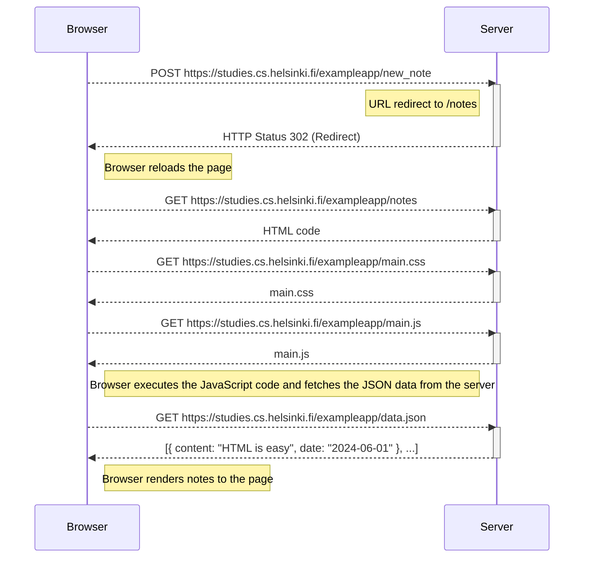

```mermaid

sequenceDiagram
    participant Browser
    participant Server

    Browser-->>Server: POST https://studies.cs.helsinki.fi/exampleapp/new_note
    activate Server
    Note left of Server: URL redirect to /notes
    Server-->>Browser: HTTP Status 302 (Redirect)
    deactivate Server

    Note right of Browser: Browser reloads the page

    Browser-->>Server: GET https://studies.cs.helsinki.fi/exampleapp/notes
    activate Server
    Server-->>Browser: HTML code
    deactivate Server

    Browser-->>Server: GET https://studies.cs.helsinki.fi/exampleapp/main.css
    activate Server
    Server-->>Browser: main.css
    deactivate Server

    Browser-->>Server: GET https://studies.cs.helsinki.fi/exampleapp/main.js
    activate Server
    Server-->>Browser: main.js
    deactivate Server

    Note right of Browser: Browser executes the JavaScript code and fetches the JSON data from the server

    Browser-->>Server: GET https://studies.cs.helsinki.fi/exampleapp/data.json
    activate Server
    Server-->>Browser: [{ content: "HTML is easy", date: "2024-06-01" }, ...]
    deactivate Server

    Note right of Browser: Browser renders notes to the page


```
